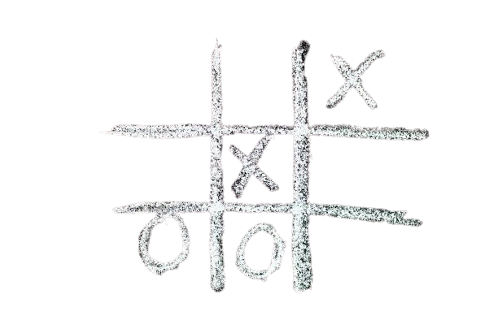

# Triqui (Tres en Raya) - Un clásico reinventado

  

**Triqui**, también conocido como **Tres en Raya**, es un juego clásico que todos conocemos y disfrutamos. Esta versión del juego combina simplicidad y diseño moderno, ofreciendo una experiencia visual agradable.

## Tecnologías Utilizadas

## Características Destacadas

- 🎨 **Diseño Minimalista**: Un estilo moderno y simple que mejora la experiencia de juego.
- 🕹️ **Jugabilidad Perfecta**: Cada movimiento es fluido y rápido, sin complicaciones.
- 💡 **Interfaz Intuitiva**: Fácil de entender y atractiva para cualquier tipo de jugador.
- 🌍 **Responsive**: Optimizado para verse bien en cualquier dispositivo.
- 🚀 **Desarrollo en JavaScript**: Todo el juego está construido con un enfoque en la eficiencia y el rendimiento.

## Agradecimientos

Gracias por tomarte el tiempo de revisar este proyecto. ¡Espero que disfrutes jugando tanto como yo disfruté desarrollándolo!
